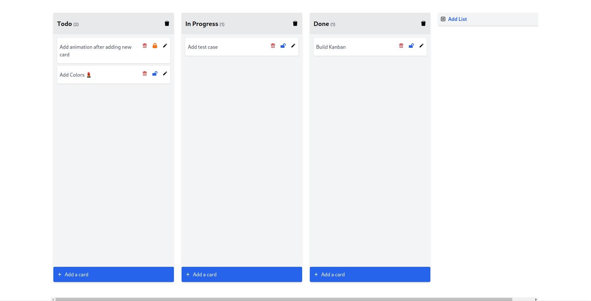

# Clean and fast Kanban board in react ❤️‍🔥

## features

- add column 🔥
- rename column by double clicking on the title column 🔥
- rename column by double clicking on the title column 🔥
- delete column 🔥
- add task 🔥
- delete task 🔥
- update task 🔥
- drag and drop task from one column to another 🔥
- lock task 🔥
- unlock task task 🔥

## to run the app,

#### `npm start`

or

#### `yarn start`

## To run tests

#### `yarn test`

or

#### `npm run test`

to run e2e tests in headed mode

#### `npm run e2e`

This project was bootstrapped with [Create React App](https://github.com/facebook/create-react-app).
